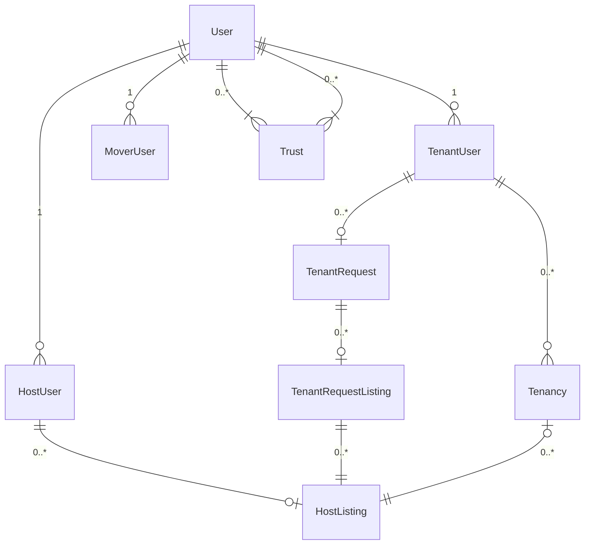

# DPSMS

## Development

### Database



### Commands

- `yarn prisma:generate`: Generate Prisma client

### Docker

Create a DB for dev with

```bash
# Destroy the dev DB
yarn run db:down
# Create the dev DB
yarn run db:up
# Push the schema
yarn run db:push
# Generate the schema
yarn run prisma:generate
```